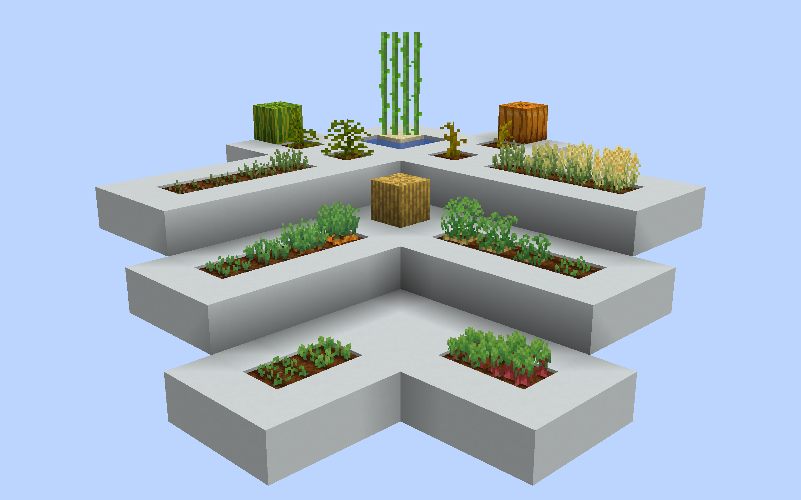

# Farming Retexture
This pack changes the appearance of farmable crops and their items. Some textures are minor tweaks, others are retextures. Feel free to modify or reuse, as long as you don't take credit for making them.

If you're here do download the zip, [here you go](https://github.com/kitlash/farming-retexture/raw/main/Farming%20Retexture.zip).

### List of all items retextured:
- Wheat
- Wheat Seeds
- Bread
- Beetroot Seeds
- Melon Seeds
- Pumpkin Seeds
- Carrots
- Golden Carrots
- Potatoes
- Baked Potatoes
- Poisonous Potatoes
- Sticks

### List of all blocks retextured:
- Hay Bales
- Wheat
- Beetroots
- Melon stems
- Pumpkin stems
- Carrots
- Potatos
- Sugar Cane

